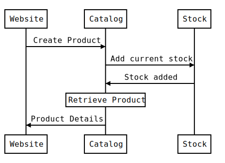

# Product Catalog Service

Product Catalog Management Microservice

### Running the application
* Run `gradle build`
* Run `gradle bootRun`

### Build and Run Docker container
* `./gradlew build -x test`
* `docker build -f ./Dockerfile -t catalog-service:local .`
* `docker run --rm -it -p 8761:8761 -e spring.profiles.active=docker --env MANAGEMENT_PATH=/admin --name catalog-service catalog-service:local` 

### Build and Deploy Docker container in K8 manually
* `./gradlew build -x test`
* `docker build -f ./Dockerfile -t {docker_username}/catalog-service:latest .`     
* `docker push {docker_username}/catalog-service:latest`
* `kubectl create -f ./deployments/{environment_profile}.yml`

### Endpoints

[http://localhost:8080/swagger-ui.html](http://localhost:8080/swagger-ui.html  ) 
 

### Diagrams

#### Add Product
